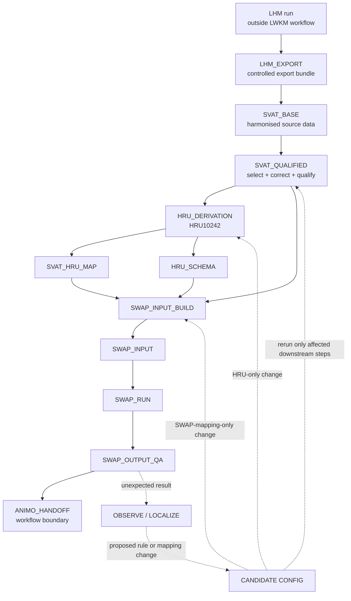

# Workflow overview

Status: **DRAFT AUTHORITY**

This diagram is the compact view of the workflow that should be shown in project documentation.



## Meaning of the feedback loop

The dashed path is not a second production route. It is the controlled research/change loop:

**OBSERVE → LOCALIZE → PROPOSE → CANDIDATE RUN → COMPARE → ACCEPT/REJECT → PERSIST**

A discovered anomaly never leads directly to a hand-edited canonical output file.

## Products at each boundary

| Boundary | Product | What it guarantees |
|---|---|---|
| LHM → LWKM | `LHM_EXPORT` | required upstream variables are complete, versioned and checksum-bound |
| source assembly | `SVAT_BASE` | one stable SVAT key, harmonised units/provenance, raw values retained |
| quality policy | `SVAT_QUALIFIED` | selection, correction, diagnosis and usage policy are explicit |
| HRU construction | `SVAT_HRU_MAP` + `HRU_SCHEMA` | HRU membership and representation are reproducible |
| SWAP construction | `SWAP_INPUT` | every input field has an explicit mapping rule |
| model execution | `SWAP_OUTPUT_QA` | run status and hydrologic QA are bound to the input run |
| next model | `ANIMO_HANDOFF` | only qualified output crosses the workflow boundary |

## Current implementation binding

The current production reconstruction maps approximately as follows:

```text
NHI/LHM server output
  ↓ gridcalc / export utilities
LHM-derived grids
  ↓ LWKM_makeHRU v0.20
SVAT information table
  ↓ selection/correction/qualification + HRU clustering R script
SVAT_HRU_MAP + HRU_SCHEMA (HRU10242)
  ↓ HRUlist2SWAP v0.38
SWAP run table + BBC/DRA/MET input
  ↓ SWAP
SWAP output + QA
```

The exact current controls and a few scientific authorities are still being bound. The canonical diagram above is intentionally cleaner than the historical implementation.
